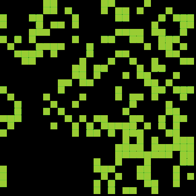

# Game of Life

**Made with <3 by [mateus.digital](https://mateus.digital).**


<p align="center">
    
</p>

## Description:

Game of Life is an implementation of the classic <a href="https://en.wikipedia.org/wiki/Conway%27s_Game_of_Life">Conway's Game of Life</a>.


You can [check it online](https://mateus.digital/game_of_life).

<br>

As usual, you are **very welcomed** to **share** and **hack** it.


## Building


```bash
git clone https://github.com/mateusdigital/game_of_life
cd game_of_life
./scripts/build-static.sh      ## Builds the webpage for the project.
```

## License:

This software is released under [GPLv3](https://www.gnu.org/licenses/gpl-3.0.en.html).


## Others:

- Email: hello@mateus.digital
- Website: https://mateus.digital
- Itch.io: https://mateusdigital.itch.io
- Linkedin: https://www.linkedin.com/in/mateusdigital
- Twitter: https://www.twitter.com/_mateusdigital
- Youtube: https://www.youtube.com/@_mateusdigital

There's more FLOSS things at [mateus.digital](https://mateus.digital) :)
